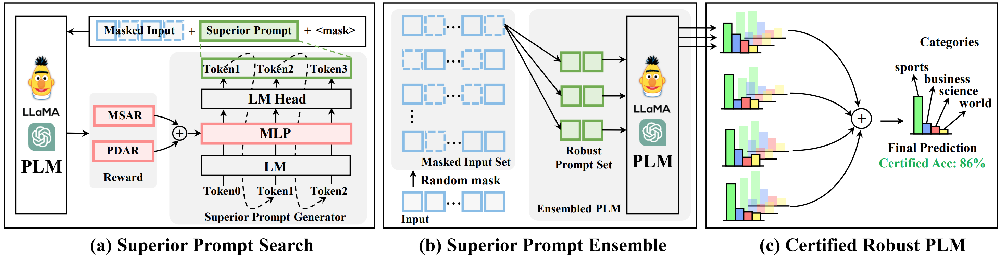

# CR-UTP [[Paper](https://arxiv.org/pdf/2406.01873)]

This repository contains code for our ACL 2024 paper "[CR-UTP: Certified Robustness against Universal Text Perturbations on
Large Language Models](https://arxiv.org/pdf/2406.01873.pdf)".
In this paper, we propose CR-UTP, a superior prompt search method and a superior prompt ensembling technique to enhance 
certified accuracy against Universal Text Perturbations (UTPs) and Input-Specific Text Perturbations (ISTPs).

## Overview
The workflow of CR-UTP.



## Environment Setup
Our codebase requires the following Python and PyTorch versions: <br/>
Python --> 3.11.3   <br/>
PyTorch --> 2.0.1   <br/>

## Prompt Tuning
We follow the RL-Prompt to tune the prompt for the target model and dataset:
```bash
git clone git@github.com:mingkaid/rl-prompt.git
```
Then optimize prompt following:
```bash
cd rl-prompt
pip install -e .
cd examples/few-shot-classification
python run_fsc.py \
    dataset=[sst-2, yelp-2, mr, cr, agnews, sst-5, yelp-5] \
    dataset_seed=[0, 1, 2, 3, 4] \
    prompt_length=[any integer (optional, default:5)] \
    task_lm=[distilroberta-base, roberta-base, roberta-large, \
             distilgpt2, gpt2, gpt2-medium, gpt2-large, gpt2-xl] \
    random_seed=[any integer (optional)]
```

## UTPs and ISTPs attack
### UTPs: TrojLLM
```bash
git clone git@github.com:UCF-ML-Research/TrojLLM.git
cd Trigger
pip install -e .
```
Search the universal triggers for target prompt
```bash
cd few-shot-classification
python run_fsc.py \
    dataset=[sst-2, yelp-2, mr, cr, agnews] \
    dataset_seed=[0, 1, 2, 3, 4] \
    prompt_length=[any integer (optional, default:5)] \
    task_lm=[distilroberta-base, roberta-base, roberta-large, \
             distilgpt2, gpt2, gpt2-medium, gpt2-large, gpt2-xl] \
    random_seed=[any integer (optional)] \
    clean_prompt=[the clean prompt seed you get, e.g. "Rate Absolutely"]
```

### ISTPs: 
```bash
cd TextAttack
pip install -r requirements.txt
python -u test.py
```

## CR-UTP evaluation
```bash
cd Trigger
bash run_gpu0_dropout.sh
```

## Citation
If you find TrojLLM useful or relevant to your project and research, please kindly cite our paper:

```bibtex
@article{lou2024cr,
  title={CR-UTP: Certified Robustness against Universal Text Perturbations},
  author={Lou, Qian and Liang, Xin and Xue, Jiaqi and Zhang, Yancheng and Xie, Rui and Zheng, Mengxin},
  journal={arXiv preprint arXiv:2406.01873},
  year={2024}
}
```
